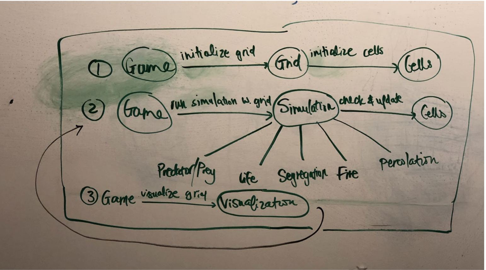

#### Team Members:
* Sumer Vardhan (sv110)
* Ha Nguyen (hn47)
* Shreya Hurli (sgh19)

## Introduction
We are attempting to create a program that uses cellular automata to simulate 5 different phenomena. The simulation assumes a grid of cells where each cell is in one out of a finite number of states. Each pass of the simulation, the cells of the grid update their state based on the states of their neighbours, as well as some rules determining state change. The simulation ends when no more cell states need to change based on the rules i.e when stasis is achieved.
The primary design goal of our project is to maximise on the common elements of all these simulations to reduce repeated code. Each simulation requires a grid of cells that are capable of expressing and changing their state. Each simulation also requires that all the cell states are updated simultaneously. The only difference between the different simulations is in the fact that the rules followed by the cells when they update are different. We plan to separate the functionality of creating a grid of cells with expressible state from the functionality of analyzing that grid to determine which cell states need to change and how. This way, we can reuse a large portion of our logic to flexibly implement any number of simulations.

## Overview
This section serves as a map of your design for other programmers to gain a general understanding of how and why the program was divided up, and how the individual parts work together to provide the desired functionality. As such, it should describe specific components you intend to create, their purpose with regards to the program's functionality, and how they collaborate with each other. It should also include a picture of how the components are related (these pictures can be hand drawn and scanned in, created with a standard drawing program, or screen shots from a UML design program). This section should discuss specific classes, methods, and data structures, but not individual lines of code.
The program will be divided up into five general components/classes: `Game`, `simulation`,  ‘Visualization’, `Grid`, and `Cell`. The `simulation` class will be a superclass that `GameOfLifeSimulation`, `SegregationSimulation`, `FireSimulation`, `PredatorPreySimulation`, and `PercolationSimulation` will extend. At the start of the program, the Game class will create a `Grid` object. The `Grid` object will set up a grid of `Cell` objects. Once this initialization is done, the `Game` class will run a game loop, which, at each run, will call the `simulation` class to analyze the grid of cells and then update their states. Once this process is finished, the `Game` class calls the `Visualization` class to render the grid at its newly updated state. 

## User Interface
The user will see a table of contents to begin with that he/she can click on to select a simulation to run. The user will then be taken to a screen with the cells initialized and a play button in the corner. There will be “fast forward” and “slow down” buttons that change the speed of the animation in the corner as well. Upon clicking the play button, the simulation the user selected begins to play. A stop button will also be located in the corner of the simulation screen. If the user clicks the stop button, the simulation will stop. If the user clicks the play button the simulation will continue. There will also be a “return to table” button in the corner of the screen that will stop the simulation and navigate the user back to the table of possible simulations to run

## Design Details 
This section describes each component introduced in the Overview in detail (as well as any other sub-components that may be needed but are not significant to include in a high-level description of the program). It should describe how each component handles specific features given in the assignment specification, what resources it might use, how it collaborates with other components, and how each could be extended to include additional requirements (from the assignment specification or discussed by your team). Include the steps needed to complete the Use Cases below to help make your descriptions more concrete. Finally, justify the decision to create each component with respect to the design's key goals, principles, and abstractions. This section should go into as much detail as necessary to cover all your team wants to say. 
 
`Game` class: This is where the Main method and the game loop is run and managed. The `Game` class first calls a `start` method that will create and initialize a `Grid` object from a configuration file. Once it has the grid, the `Game` class will pass this `Grid` to the `simulation` class to create a new `simulation` object. The `Game` class then uses this `simulation` object within the game loop to analyze and update cells. Once cells have been analyzed and updated, the `Game` class will also call the `Visualization` class in the game loop to render the grid; this process ends until no more possible change can be made to the grid or when the user terminates the program. 
`simulation` Class: The `simulation` class is an abstract class that is extended by 5 subclasses: `GameOfLifeSimulation`, `SegregationSimulation`, `FireSimulation,` `PredatorPreySimulation`, and `PercolationSimulation`. The `simulation` class stores the `Grid` object passed into it by the `Game` class, and is primarily responsible for updating and changing this `Grid` object. The `simulation` class has two elements methods: `Analyze` and `Update`. The `Analyze` method is responsisble for iterating through the cells in the grid and prompting each cell to check the state of their neighbors to know which state to update to. Once all the cells have finished checking, the `simulation` class provides the `Update` method in order for the cells to actually change state. This is necessary so that no cell will change state before its neighbor has a chance to make their calculations based on that cell’s original state. The set-up for the simulation class will allow it to be subclassed for more cellular automata simulations that have not yet been specified. 
`Grid` class: The grid class has a powerful constructor that reads from a `Config` file and constructs an N x N grid of `Cell` objects. Once all the entire grid has been initialized, the `Grid` class will have another method to go through each Cell in the grid and set the neighbors of those cells. By the time the configuration is done, each cell will have access to all the cells who are its neighbors, so they can check the state of their neighbors at each simulation run later on. By reading information for configuring the grid from a file, this allows for flexible changes to the configuration, such as with how big the cells need to be or etc. to be made. 
`Cell` class: The cell class is responsible for knowing its X and Y position within the larger grid, as well as for knowing its current state, its next state to be updated to after analyzing its neighbors, and how many neighbors it has and who those are. In terms of behaviors, the cell should be able to analyze its neighbors and set its next state to be updated to, and then update its current state to this next state when the simulation calls for it.
‘Visualization’ class: The visualization class is responsible for navigating to different simulations depending on which simulation is selected. The visualization class will receive the appropriate file names from each simulation class in order to determine how each cell’s state will be represented. The visualization class will have a `makeScene` method that sets up the initial scene with the initial state and have an `updateScene` method to continuously update the Scene after each cell update. 

## Design Considerations 

We discussed our design at length and debated the pros and cons of dividing up the code in different ways. We spent a majority of our time deciding how classes will store and share data to ensure that we have a concrete data sharing model before we start coding. 
One big consideration we made was which class should store a collection of all the generated cells - the Cell class or the Grid class. We decided that the Grid class should store this information so that the cell class is simply a template for creating cells that can return all the neighbours of a given cell or its state. It can also store the next state it will transition to. The grid class can now pass on the collection of cells to a simulation class which can analyze the neighbours of each cell and determine its next state. It can then call an updateState method on each cell and simultaneously update all the cells.

Another big consideration was whether or not we need subclasses of our visualisation class. We decided that each of the simulations can be abstracted as having three unique states - empty followed by 2 other arbitrary states. Instead of subclassing more than needed, we decided to simply pass three files for the relevant states to the visualisation class from each corresponding simulation subclass. This way, we can generalise the visualisation process for any simulation involving up to three states.
One design decision our group discussed at length was which classes to subclass and which to not. 

## Team Responsibilities
This section describes the program components each team member plans to take primary and secondary responsibility for and a high-level plan of how the team will complete the program.
We’ll work together to get the basic prototype of Game Of Life working. The goal is to ensure that our basic program structure is sound and functions. At this point, we will start working 
on different simulation subclasses to implement each of the 5 required simulations. We have mini goals within the sprint that are broken down. The first goal is to get the Cell and Grid 
(basically the configuration) finished; Ha will take primary responsibility for this and Shreya will take secondary responsibility as Sumer overwatches and gives input. Then, in the second 
mini sprint goal, we will get the Game of Life simulation and Game class working; Shreya will take primary responsibility for this and Sumer will take secondary responsibility as Ha overwatches 
and gives input. Then, in the third mini goal, we will get the visualization for the Game of Life working; Sumer will take primary responsibility for this and Ha will take secondary responsibility 
as Shreya overwatches and gives input. By the time the Game of Life is finished, we will all have a good understanding of each part of the code. Then, from there, one person will be responsible for 
the FireSimulation, one person will be responsible for SegregationSimulation, and one person will be responsible for Predator/Prey simulation (the actual breakdown of this does not really matter, as 
they should all be pretty similar in workload); whoever finishes theirs before the others can take on the last simulation, which is Percolation (which is a more simple simulation to do compared to 
the other three, so it shouldn’t be substantial); then, as more team members finish, they can begin to help with Percolation. 
 
 

